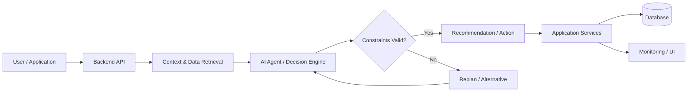
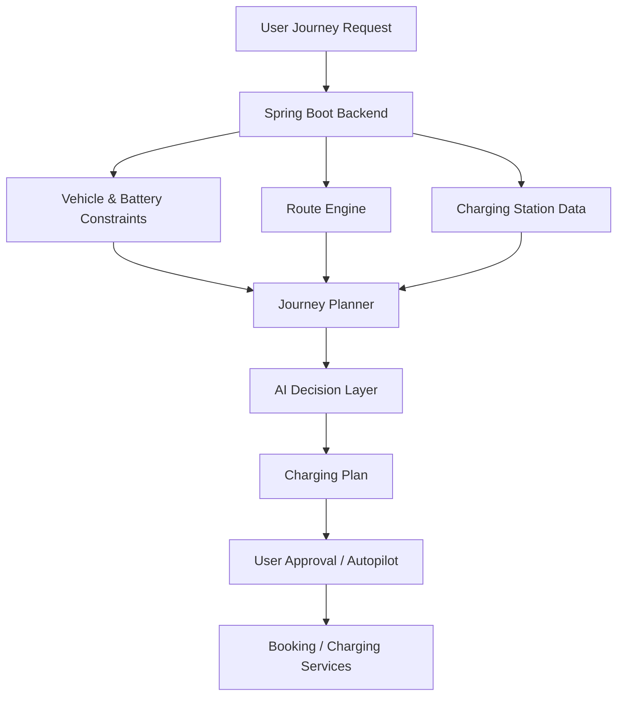
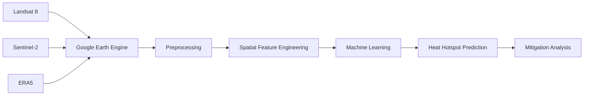
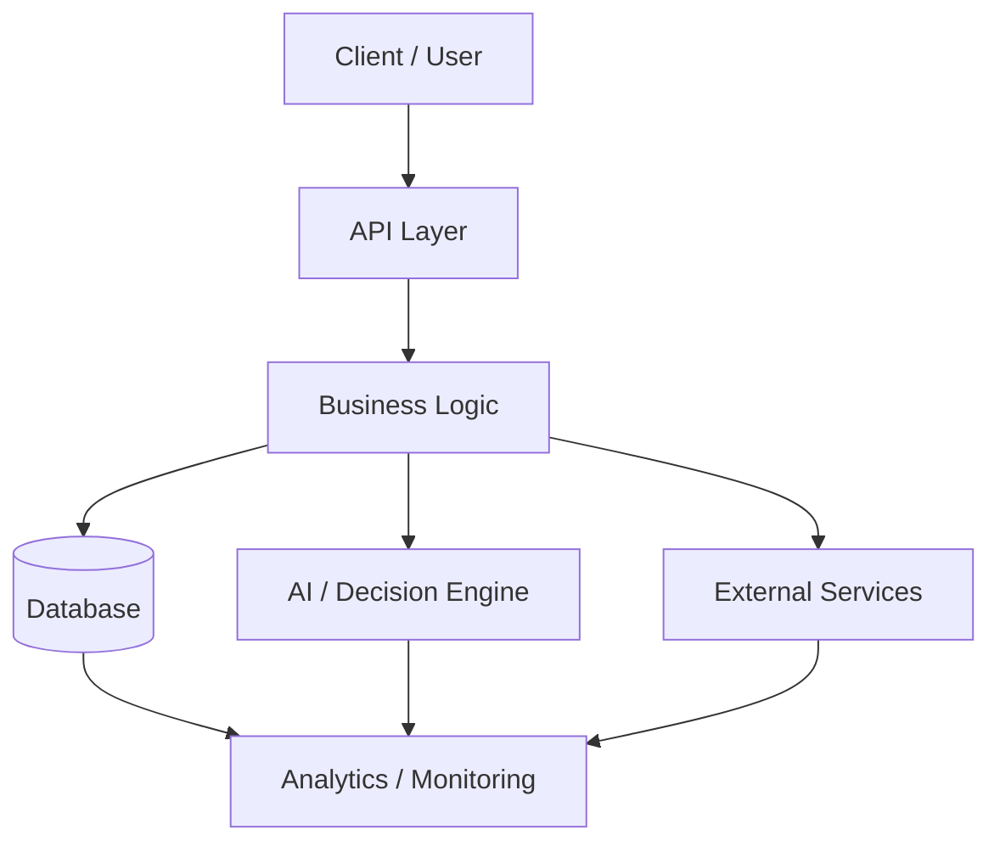

<div align="center">

# 👋 Hi, I'm Priyanshu Sharma

### Backend Engineering · AI Systems · Data & Geospatial Computing

I build software systems around **backend engineering, AI, databases, real-time data, and geospatial computing**.

I enjoy taking ideas from:

**Problem → Architecture → Backend → Intelligence → Integration → Working Product**

[](https://github.com/cs1m2414238)
[](https://www.linkedin.com/in/priyanshu-sharma-b85b8a335/)

</div>

---

# 🚀 About Me

I'm a Computer Science student interested in building systems that combine:

```text
Backend Engineering
        +
Database Systems
        +
AI & Intelligent Agents
        +
Real-Time Processing
        +
Data & Geospatial Computing
```

My main areas of interest are:

* ☕ **Java & Spring Boot**
* 🧠 **AI agents and intelligent applications**
* 🗄️ **PostgreSQL, SQL & database design**
* ⚡ **Real-time and event-driven systems**
* 🌍 **Geospatial computing & spatial analytics**
* 🏗️ **System design & backend architecture**
* 📊 **Data analytics & visualization**
* ☁️ **Cloud, containers & deployment**

I prefer projects where software has to process **real-world data**, enforce constraints, make useful decisions, and coordinate multiple services.

---

# 🧩 Engineering Focus

## ⚙️ Backend Engineering

I enjoy designing applications with clear separation between APIs, business logic, persistence, and external services.

```text
Client
  ↓
REST API
  ↓
Controller
  ↓
Service Layer
  ↓
Business Logic
  ↓
Repository
  ↓
Database
```

Working with:

* Java
* Spring Boot
* REST APIs
* Authentication & authorization
* Service-layer architecture
* PostgreSQL
* MySQL
* Database migrations
* API integrations
* Real-time communication

---

## 🧠 AI & Agent Systems

I'm interested in applications where AI is integrated into an actual software system instead of existing as an isolated model.



Areas I'm exploring:

* AI agent architecture
* LLM integration
* Context-aware decision making
* Tool-using agents
* Retrieval and memory
* Constraint-based planning
* AI-assisted backend workflows
* Evaluation of agent decisions

---

## 🗄️ Data & Database Systems

I enjoy working on the part of software that turns raw information into reliable application state.

Areas I'm developing:

* Relational database design
* PostgreSQL
* MySQL
* SQL querying
* Schema normalization
* Indexing
* Query optimization
* Spatial databases
* PostGIS
* Data pipelines
* Analytics-oriented data models

---

# 🔥 Featured Projects

## ⚡ Vidyut — AI-Powered EV Charging Platform

A full-stack EV charging and journey-planning system that combines **backend services, routing, constraints, charging infrastructure, and AI-assisted decisions**.

### Core Flow



### Features

* Battery-aware journey planning
* Charger discovery
* Connector compatibility
* Cost-aware charging decisions
* Time-based optimization
* Balanced journey optimization
* Minimum battery reserve
* Charging-budget constraints
* Dynamic rerouting
* Charging session management
* Charging-company workflows
* Property-owner / host workflows
* AI-assisted journey planning

### Backend Architecture

```text
Web / Mobile Client
        ↓
Spring Boot REST API
        ↓
Service Layer
        ↓
Journey + Charging Logic
        ↓
Routing / AI Components
        ↓
PostgreSQL
```

### Tech

`Java` `Spring Boot` `PostgreSQL` `React` `React Native` `OSRM` `Docker` `AI Agents`

🔗 [Explore Vidyut](https://github.com/cs1m2414238/vidyutEV-1.0)

---

## 🌍 Geospatial AI for Urban Heat Mitigation

A geospatial AI framework for identifying urban heat hotspots and evaluating possible cooling interventions using satellite, climate, and spatial datasets.

### Data Pipeline



### Areas Covered

* Satellite-data processing
* Urban heat hotspot detection
* Geospatial feature engineering
* Machine-learning prediction
* Cooling-intervention analysis
* Spatial databases
* Backend integration

### Tech

`Python` `Google Earth Engine` `Landsat 8` `Sentinel-2` `ERA5` `XGBoost` `PostGIS` `Spring Boot`

---

## 🪖 Military Logistics & Fleet Readiness Command Center

A data-oriented application focused on **fleet readiness, logistics monitoring, reporting, and operational analytics**.

### Areas Explored

* Fleet-readiness metrics
* Logistics data organization
* Operational dashboards
* Analytics
* Reporting
* Data visualization

🔗 [View Project](https://github.com/cs1m2414238/Military-Logistics-Fleet-Readiness-Command-Center)

---

## 📝 Text-Pro

A Java-based text-processing project focused on efficient document processing, parsing, algorithms, and software design.

### Focus

* Java
* Object-oriented design
* Efficient parsing
* Text processing
* Data structures
* Performance improvement

🔗 [View Text-Pro](https://github.com/cs1m2414238/Text-Pro)

---

# 🏗️ How I Think About Systems



I try to keep clear boundaries between:

* API layer
* domain logic
* persistence
* AI components
* external integrations
* analytics
* infrastructure

---

# 🛠️ Tech Stack

## Languages

<p>


</p>

## Backend

<p>


</p>

## Databases

<p>


</p>

## Frontend

<p>


</p>

## AI & Data

<p>


</p>

## Tools & Infrastructure

<p>


</p>

---

# 🔭 Currently Exploring

```java
while (learning) {

    understandProblem();

    designArchitecture();

    build();

    test();

    measure();

    improve();
}
```

Current focus:

* Advanced Java & Spring Boot
* Backend architecture
* System design
* Distributed systems
* PostgreSQL & database performance
* AI agent orchestration
* LLM-powered applications
* Geospatial machine learning
* Data analytics
* DevOps & deployment

---

# 📊 GitHub Activity

<div align="center">


</div>

---

# 📈 Contribution Activity

<div align="center">


</div>

---

# 🎯 What I Want to Build

I'm particularly interested in projects where several engineering areas come together:

```text
Backend Engineering
        +
AI
        +
Databases
        +
Real-Time Data
        +
Analytics
        +
Infrastructure
```

Areas that interest me include:

* AI-powered applications
* Backend platforms
* Decision-support systems
* Geospatial applications
* Data-intensive systems
* Real-time applications
* Developer tools
* Infrastructure-focused software

> **I want to build software that understands real-world information, makes useful decisions, and turns those decisions into reliable applications.**

---

# 💡 Engineering Philosophy

```text
Don't just make it run.
Understand why it works.

Don't just add features.
Design the system.

Don't use technology because it's popular.
Know why it belongs there.

Build → Measure → Learn → Improve.
```

---

# 🤝 Open To

* 💻 Software Engineering Internships
* ☕ Backend Engineering
* 🧠 AI / Agent Systems
* 🔬 Research Internships
* 🌍 Geospatial Computing
* 📊 Data & Analytics
* 🛠️ Open Source
* 🏆 Hackathons

---

<div align="center">

# 🌐 Let's Connect

[](https://www.linkedin.com/in/priyanshu-sharma-b85b8a335/)

[](https://github.com/cs1m2414238)

---

### `Design thoughtfully. Build deeply. Keep improving.`

⭐ Explore my repositories or reach out if you'd like to collaborate.

</div>
